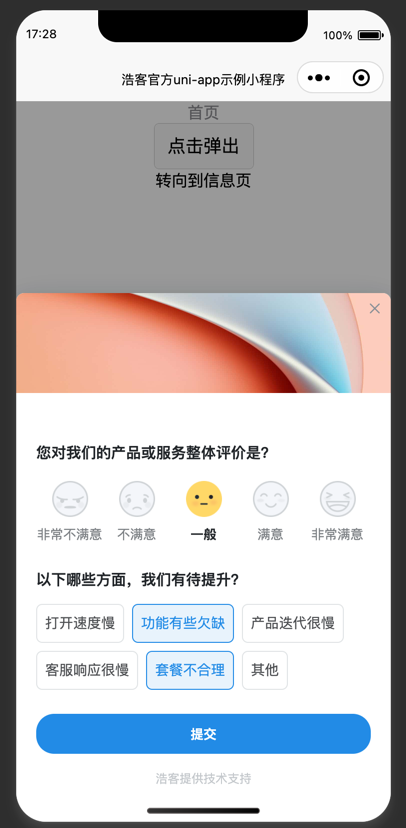

# howxm-uniapp-wechat-miniprogram-demo
* 这是浩客官方提供的uniapp微信小程序demo，包含了在uniapp这种集成浩客小程序插件的基本使用方法。
* 详细文档请参考 https://howxm.com/help/articles/x-sdk-uniapp
  

# 使用
1. 下载代码库，并在HBuilderX中打开
2. 以微信小程序运行，HBX会自动打包编译，然后自动打开微信开发者工具
3. 在微信开发者工具中，点击“编译”，即可看到demo运行效果（一般微信开发者工具会自动编译，无需执行此步骤）

# 注意事项
* 当前项目中默认配置了浩客官方提供的测试appid，开发者可以直接使用
* 启动后会自动弹出问卷
* 也可以点击中间的按钮，手动弹出问卷

# 如何集成自己的问卷
1. 在[浩客官网](https://howxm.com)注册账号，创建微信小程序应用，参考 https://howxm.com/help/articles/x-sdk-miniapp
2. 在浩客系统中创建问卷，并设置问卷访问时自动弹出
3. 在HBuilderX中，打开本项目，修改`manifest.json`中的`appid`为自己的小程序appid
4. 保存后在微信开发者工具中运行即可 
